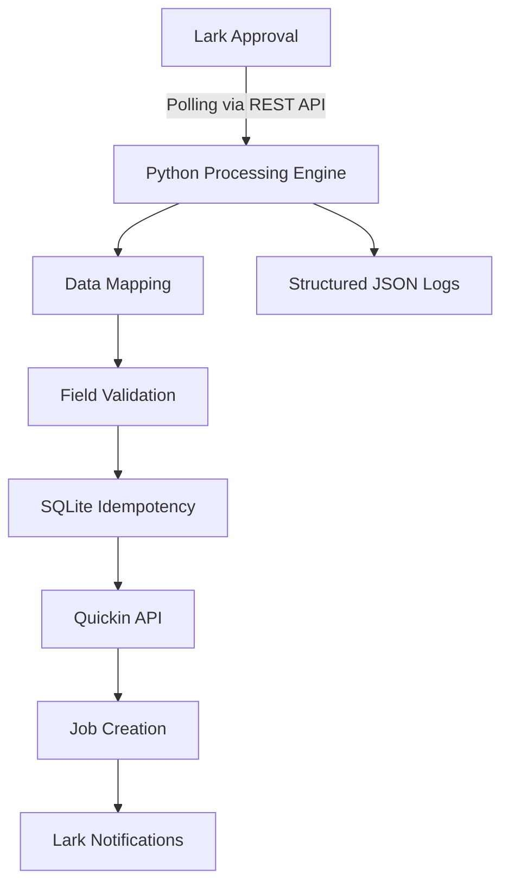

# System Architecture

```mermaid
flowchart TD
    A[Lark Approval] -->|Polling via REST API| B[Python Processing Engine]
    B --> C[Data Mapping]
    C --> D[Field Validation]
    D --> E[SQLite Idempotency]
    E --> F[Quickin API]
    F --> G[Job Creation]
    G --> H[Lark Notifications]
    B --> I[Structured JSON Logs]
```
